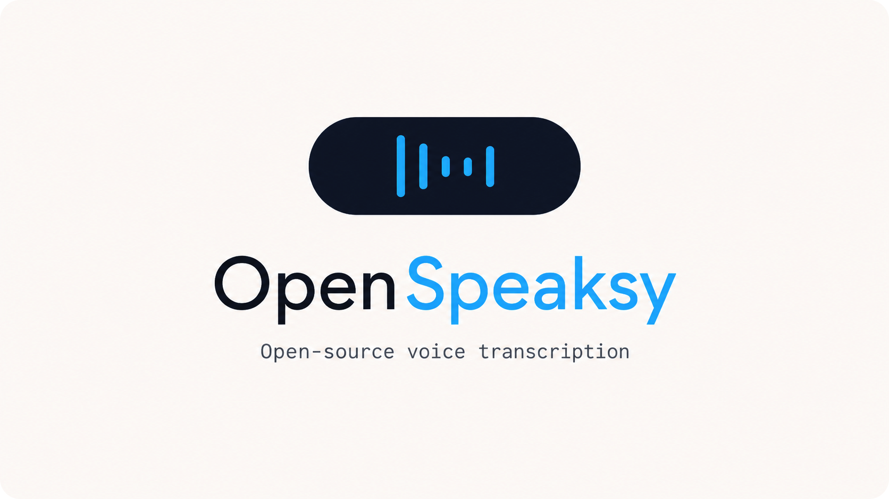

<div align="center">

# OpenSpeaksy

**Free, fully local voice dictation for macOS.**
Hold right Command, speak, let go. The text appears in any app.

[](LICENSE)
[]()
[]()
[]()

<br>



</div>

---

## A free alternative to Wispr Flow, Superwhisper, Whisper Memos

Same idea — without the strings. No subscription, no usage cap, no account, no ads, no cloud round-trip. Same Whisper Large v3 model under the hood.

| | OpenSpeaksy | Typical paid app |
|---|---|---|
| Price | **Free forever** (MIT) | $10 – 15 / month |
| Where audio goes | Your Mac, always | Often their servers |
| Account / signup | None | Required |
| Usage limits | None | Daily / monthly caps |
| Ads & upsells | Never | Sometimes |
| Source code | Open | Closed |

---

## What you get

- **Free forever.** MIT licensed. No accounts, no subscriptions, no telemetry.
- **Fully local.** Audio never leaves your Mac. No internet required after install.
- **Fast.** Whisper Large v3 on Apple Neural Engine — ~0.3 – 0.6 s for short phrases.
- **Multilingual.** Auto-detects language. Handles Russian, English, mixed speech well.
- **Reliable.** Recordings are queued to disk; nothing is lost if anything crashes.
- **Drop-in install.** Hand the repo to any AI coding agent — it sets everything up for you.

## Install

### One-prompt install (recommended)

Open **Claude Code**, **Codex CLI**, **Cursor**, or any AI coding agent. Paste this:

```
Install OpenSpeaksy on this Mac:

git clone https://github.com/sergeyizmailov/OpenSpeaksy.git ~/OpenSpeaksy
cd ~/OpenSpeaksy
./scripts/install.sh

Then walk me through granting Input Monitoring and Accessibility permissions
in System Settings → Privacy & Security.
```

The installer handles Xcode CLT, Homebrew, the model download, and the LaunchAgents. Hands-free except the two permission prompts.

### Manual install

```bash
git clone https://github.com/sergeyizmailov/OpenSpeaksy.git
cd OpenSpeaksy
./scripts/install.sh
```

Then grant **Input Monitoring** and **Accessibility** to `venv/bin/python` in System Settings → Privacy & Security.

## Usage

Hold **right ⌘**, speak, release. Done. The transcription pastes into the focused text field and stays in your clipboard.

A small pill appears at the top of the screen:
- **Animated bars** while recording
- **Spinner** while transcribing
- **Red `!`** if anything fails

Recordings shorter than 1 second are skipped. Common Whisper hallucinations ("Subscribe", "Спасибо за просмотр", etc.) are filtered.

## Configuration

### Change the hotkey

Default is **right Command**. Edit two constants near the top of [`main.py`](main.py):

```python
HOTKEY_KEYCODE = 0x36   # right Command
HOTKEY_FLAG    = 0x10   # left/right distinguishing flag
```

Common alternatives:

| Key | KEYCODE | FLAG |
|---|---|---|
| Right Command (default) | `0x36` | `0x10` |
| Left Command | `0x37` | `0x08` |
| Right Option | `0x3D` | `0x40` |
| Left Option | `0x3A` | `0x20` |
| Right Control | `0x3E` | `0x2000` |
| Right Shift | `0x3C` | `0x04` |

After editing, restart: `launchctl stop com.openspeaksy` (KeepAlive auto-restarts it).

### Model

Default: **Whisper Large v3** — the only model we recommend. Smaller variants (`medium`, `small`) trade noticeable quality for speed, especially on Russian and mixed RU/EN. `large-v3-turbo` is faster but loses precision on punctuation and proper nouns. Stick with `large-v3` unless you know what you're doing.

### whisper.cpp version

```bash
WHISPER_CPP_REF=master ./scripts/install.sh   # track upstream HEAD instead of v1.7.5
```

Recording threshold, watchdog timeouts, and overlay style live in `main.py` and `overlay.py`. The whole codebase is under 1000 lines.

## How it works

Two LaunchAgents run in the background:

| Service | Role |
|---|---|
| `com.openspeaksy.whisper` | `whisper-server` from whisper.cpp on `127.0.0.1:8178`, model resident in RAM, encoder loaded onto the Apple Neural Engine |
| `com.openspeaksy` | Python control process: CGEventTap for the hotkey, PortAudio for capture, NSPanel overlay, NSPasteboard + synthetic ⌘V for paste |

Recordings are written atomically to `.pending/` (mode `0700`, files `0600`) before transcription and deleted only after a successful paste. A watchdog auto-recovers stuck states. Per-job generation tokens prevent any stale worker from ever pasting old text into your current app — even if a watchdog reset and a new recording happen in between.

## Performance

On Apple M2, Whisper Large v3 with the Core ML encoder running on ANE:

| Audio length | Latency |
|---|---|
| 1 s | ~0.3 s |
| 5 s | ~0.6 s |
| 11 s (JFK sample) | ~1.7 s |
| 30 s | ~4 s |

ANE acceleration gives a 2 – 3× speedup over CPU-only on short dictation, where the encoder dominates.

## Logs

```bash
tail -f ~/Library/Logs/com.openspeaksy/main.log     # app log, rotated to 6 MB max
tail -f /tmp/openspeaksy-whisper.log                # whisper-server log
```

The app log captures startup health checks, watchdog events, errors, and recovery. Per-transcription chatter is intentionally suppressed for privacy and brevity.

## Uninstall

```bash
./scripts/uninstall.sh
```

Removes the LaunchAgents and logs. Project files, the model, and any queued recordings are left intact — delete the directory manually if you want a full wipe.

## Built on

- [whisper.cpp](https://github.com/ggml-org/whisper.cpp) by Georgi Gerganov — the engine that does the actual work
- [OpenAI Whisper](https://github.com/openai/whisper) — the underlying model
- [PyObjC](https://github.com/ronaldoussoren/pyobjc) — for the macOS event tap and overlay

## License

MIT — see [LICENSE](LICENSE).
