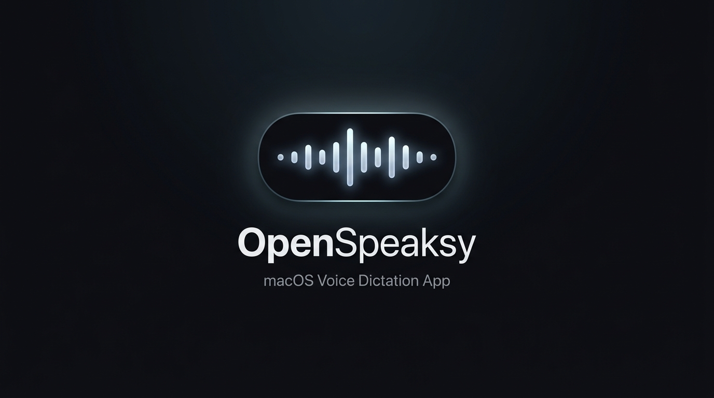

<div align="center">

# OpenSpeaksy

**Voice dictation for macOS, powered by Mistral Voxtral Mini Transcribe 2.**
Hold right Command, speak, let go. The text appears in any app.

[](https://github.com/sergeyizmailov/OpenSpeaksy/actions/workflows/ci.yml)
[](LICENSE)
[]()
[](https://docs.mistral.ai/models/model-cards/voxtral-mini-transcribe-26-02)

<br>



</div>

---

## An open alternative to Wispr Flow, Superwhisper

Same idea with your own API credentials: Mistral Voxtral Mini Transcribe 2 handles transcription, while Mistral Medium 3.5 translates Russian into English or Polish. ElevenLabs Scribe v2 remains available as a fallback. No OpenSpeaksy account, ads, or tracking.

| | OpenSpeaksy | Typical paid app |
|---|---|---|
| Price | **MIT licensed** — bring your own API keys | $10 – 15 / month |
| Transcription latency | Network-dependent | similar |
| Account / signup | One Mistral key | Required |
| Usage limits | Your providers' quotas | Daily / monthly caps |
| Ads & upsells | Never | Sometimes |
| Source code | Open | Closed |

---

## What you get

- **Open.** MIT licensed. No OpenSpeaksy account or telemetry; credentials stay in your local LaunchAgent plist.
- **Accurate.** Voxtral Mini Transcribe 2 provides fast batch transcription across 13 supported languages.
- **Multilingual.** Auto-detects supported languages and handles Russian and English well.
- **Reliable.** Recordings are queued to disk; nothing is lost if the transcription service is unreachable.
- **Drop-in install.** Hand the repo to any AI coding agent — it sets everything up.

## Install

Pick the path that fits you. Both end up at the same place: a working install in about five minutes.

### Prerequisites — one required API key

- **Mistral (required):** create a [Mistral API key](https://console.mistral.ai/api-keys) for Voxtral transcription and Mistral Medium translation.
- **ElevenLabs (optional):** add a key only if you want the retained Scribe v2 fallback.

### Option A — One-prompt install (recommended if you don't use Terminal)

Open **Claude**, **ChatGPT**, **Cursor**, or any AI coding assistant. Paste this:

```
Install OpenSpeaksy on this Mac:

git clone https://github.com/sergeyizmailov/OpenSpeaksy.git ~/OpenSpeaksy
cd ~/OpenSpeaksy
./scripts/install.sh

The installer will ask for my Mistral API key, plus an optional ElevenLabs fallback key — I'll paste them when prompted.
Then walk me through granting Input Monitoring and Accessibility permissions
in System Settings → Privacy & Security.
```

The assistant runs the commands, asks for your key at the right moment, and tells you exactly which two switches to flip in System Settings. No Terminal knowledge needed.

### Option B — Manual install

If you'd rather drive the Terminal yourself:

**1.** Clone and run the installer:

```bash
git clone https://github.com/sergeyizmailov/OpenSpeaksy.git ~/OpenSpeaksy
cd ~/OpenSpeaksy
./scripts/install.sh
```

When prompted, paste your Mistral API key; optionally retain an ElevenLabs fallback key. The installer creates a Python venv, generates the LaunchAgent plist (stored at `0600` so only your user can read it), and starts the background service.

**2.** Grant macOS permissions. Open **System Settings → Privacy & Security**:

- **Input Monitoring** — turn on for `~/OpenSpeaksy/venv/bin/python`
- **Accessibility** — turn on the same binary
- **Microphone** — macOS will prompt on the first recording; click **Allow**

**3.** Try it. Hold right Command, say something, let go. The text appears wherever your cursor is.

To verify the service is running:

```bash
tail -f ~/Library/Logs/com.openspeaksy/main.log
```

You should see `OpenSpeaksy running — hold right Command (dictate), right Option (Russian→English), or right Shift (→Polish)`.

## Usage

Three hotkeys:

- **Right ⌘** — dictate in a Voxtral-supported language; the text pastes verbatim.
- **Right ⌥ (Option)** — dictate Russian, paste English. Voxtral transcribes in Russian, then Mistral Medium translates it before pasting.
- **Right ⇧ (Shift)** — dictate Russian, paste Polish. Voxtral transcribes with `language="ru"`, then Mistral Medium translates the result into Polish.

Hold the key, speak, release. The text pastes into the focused field and stays in your clipboard.

A small dark pill appears near the bottom of the screen. All hotkeys share the same pill; transform modes add a thin label above it:

- **Pill, no label** — dictate (right ⌘)
- **Pill with "English" label** — Russian-to-English translation (right ⌥)
- **Pill with "Polish" label** — Russian-to-Polish translation (right ⇧)
- **Animated bars** while recording, **spinner** while transcribing (or translating), **coral `!`** if a provider returns an error

Recordings shorter than 1 second are skipped. Common speech-model hallucinations ("Subscribe", "Спасибо за просмотр", etc.) are filtered out automatically.

## Configuration

### Change a hotkey

Two pairs of constants near the top of [`main.py`](main.py) — the dictate hotkey and the Russian→English translate hotkey:

```python
HOTKEY_KEYCODE    = 0x36   # right Command — dictate
HOTKEY_FLAG       = 0x10
TRANSLATE_KEYCODE = 0x3D   # right Option  — Russian → English
TRANSLATE_FLAG    = 0x40
```

Common alternatives:

| Key | KEYCODE | FLAG |
|---|---|---|
| Right Command (default) | `0x36` | `0x10` |
| Left Command | `0x37` | `0x08` |
| Right Option | `0x3D` | `0x40` |
| Left Option | `0x3A` | `0x20` |
| Right Control | `0x3E` | `0x2000` |
| Right Shift | `0x3C` | `0x04` |

After editing, restart: `launchctl stop com.openspeaksy` (KeepAlive auto-restarts it).

### Tune providers and translate quality

The translate path (right ⌥) does Voxtral transcription → LLM translation → second LLM pass to polish phrasing on longer outputs. Environment variables in `~/Library/LaunchAgents/com.openspeaksy.plist` tune it without touching code:

| Variable | Default | Effect |
|---|---|---|
| `OPENSPEAKSY_STT_BACKEND` | `mistral` | STT provider: `mistral` or `elevenlabs` |
| `OPENSPEAKSY_DICTATE_LANGUAGE` | empty | Language hint for right Command; empty means auto-detect, `ru` forces Russian |
| `OPENSPEAKSY_POLISH_STT_BACKEND` | `mistral` | STT provider used only by right Shift; the language hint is always Russian |
| `MISTRAL_MODEL` | `voxtral-mini-2602` | Primary speech-to-text model |
| `MISTRAL_TRANSLATION_MODEL` | `mistral-medium-3-5` | Model used to translate and refine English/Polish output |
| `MISTRAL_TRANSLATION_TEMPERATURE` | `0.2` | Lower = more literal, higher = more natural phrasing |
| `ELEVENLABS_MODEL` | `scribe_v2` | Model used by the retained ElevenLabs fallback |

After editing, reload the agent (`launchctl unload ... && launchctl load ...`).

### Rotate or change the API key

Edit `~/Library/LaunchAgents/com.openspeaksy.plist`, change `MISTRAL_API_KEY` or the optional `ELEVENLABS_API_KEY`, then:

```bash
launchctl unload ~/Library/LaunchAgents/com.openspeaksy.plist
launchctl load   ~/Library/LaunchAgents/com.openspeaksy.plist
```

## How it works

A single LaunchAgent (`com.openspeaksy`) runs `main.py`. It captures audio with PortAudio, watches for the hotkey via CGEventTap, persists each recording atomically to `.pending/`, POSTs the WAV to Mistral Voxtral, then writes the response to the clipboard and synthesizes ⌘V into the focused app.

Translate mode (right ⌥) asks Voxtral for Russian (`language="ru"`), then `mistral-medium-3-5` translates the Russian to English. For outputs of 40+ characters, a second Mistral call polishes awkward phrasing; if it errors, the first-pass translation is kept.

Polish mode (right ⇧) mirrors translate mode: it requests Russian transcription (`language="ru"`), then asks Mistral Medium for a Polish translation and optionally refines longer output. `OPENSPEAKSY_POLISH_STT_BACKEND` can select the retained ElevenLabs STT provider without changing that Russian-only contract.

A separate watchdog thread auto-recovers stuck states. Per-job generation tokens prevent any stale worker from ever pasting old text into your current app — even if a watchdog reset and a new recording happen in between. The pending filename encodes the selected mode, so recovery after a crash preserves intent. If a provider is unreachable, the audio stays in `.pending/`; the next startup transcribes it and writes the combined result to the clipboard (it never auto-pastes — focus at login is unrelated to the dictation context).

## Performance

The Mac does almost nothing beyond audio capture and HTTPS requests. End-to-end latency depends on audio length, network conditions, and current provider load.

## Logs

```bash
tail -f ~/Library/Logs/com.openspeaksy/main.log     # app log, rotated to 6 MB max
```

Captures startup, watchdog events, errors, and recovery. Per-transcription text is intentionally never logged — only lengths, paths, and errors.

## Troubleshooting

| Symptom | Likely cause |
|---|---|
| Hotkey ignored, nothing happens | Input Monitoring not granted to `venv/bin/python` |
| Recording works but text doesn't paste | Accessibility not granted to the same binary |
| No microphone prompt on first try | Microphone permission denied earlier — re-enable in System Settings |
| Coral `!` overlay every time | Mistral/selected STT key invalid, quota exhausted, or no internet — check the log |
| Hotkey ignored only in some apps (1Password, sudo prompts) | macOS Secure Input is active there; click out and back in |

For specifics, check the [log](#logs).

## Uninstall

```bash
./scripts/uninstall.sh
```

Removes the LaunchAgent and logs. Project files and any queued recordings are left intact — delete the directory manually if you want a full wipe.

## Built on

- [Mistral Audio Transcriptions](https://docs.mistral.ai/models/model-cards/voxtral-mini-transcribe-26-02) — Voxtral Mini Transcribe 2
- [ElevenLabs Speech to Text](https://elevenlabs.io/docs/overview/capabilities/speech-to-text) — retained Scribe v2 fallback
- [Mistral Medium 3.5](https://docs.mistral.ai/models/model-cards/mistral-medium-3-5-26-04) — Russian-to-English/Polish translation
- [PyObjC](https://github.com/ronaldoussoren/pyobjc) — for the macOS event tap and overlay

## License

MIT — see [LICENSE](LICENSE).
