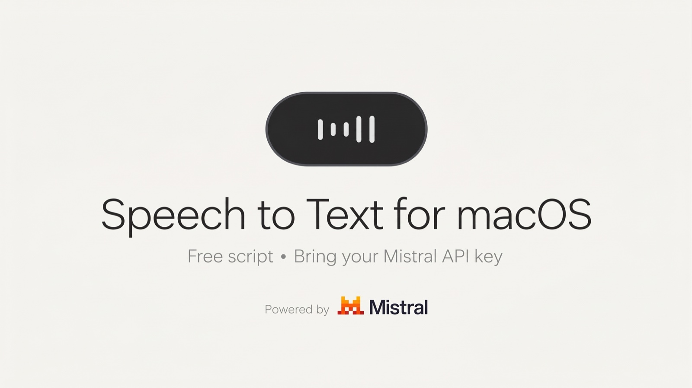

<div align="center">

# OpenSpeaksy

**Lightweight, private voice dictation and translation for macOS.**  
Powered by Mistral.

[](https://github.com/sergeyizmailov/OpenSpeaksy/actions/workflows/ci.yml)
[](LICENSE)
[]()
[](https://docs.mistral.ai/)
[](https://docs.mistral.ai/)

<br>



</div>

---

## Overview

OpenSpeaksy is a native, open-source macOS menu-less background service for instant voice-to-text dictation and real-time translation. Bring your own Mistral API key — no subscriptions, accounts, or telemetry.

| Feature | OpenSpeaksy | Typical Paid App |
|:---|:---|:---|
| **Pricing** | **Free & Open Source** (MIT) — BYO API key | $10 – $15 / month |
| **Privacy** | 100% local daemon, zero tracking, keys in `0600` plist | Cloud telemetry & accounts |
| **STT Engine** | **Mistral Voxtral** (multilingual, jargon-aware) | Generic Whisper or proprietary |
| **Translation** | **Mistral** (natural human phrasing) | Basic machine translation |
| **Reliability** | Atomic disk buffer, watchdog, background crash recovery | Audio lost on app crash |

---

## Hotkeys

Hold the key, speak, release. The text pastes directly into the active field and remains in your clipboard.

| Hotkey | Action | Description |
|:---|:---|:---|
| **Right ⌘** | **Dictate** | Transcribes spoken audio in any supported language with zero prompt bias. |
| **Right ⌥** | **Translate (EN)** | Dictate in Russian → pastes natural, idiomatic English. |
| **Right ⇧** | **Translate (PL)** | Dictate in Russian → pastes natural, idiomatic Polish. |
| **Caps Lock** | **Cancel** | Tap to stop a transcription that has been running more than 10 seconds. The audio is kept — only the automatic retries stop. Tap twice quickly to retry everything waiting. |

The 10-second wait is deliberate: a normal transcription takes a second or
two, so a capital letter typed just after speaking never interrupts one. A tap
with nothing stuck to act on does nothing at all.

A dropped connection never costs you a recording: the audio is saved before
the request, the pill says when it will be retried
(`No connection — retrying in 10s`), and the schedule escalates from 10s to
5 minutes until it goes through. A recovered transcript lands in the clipboard
with a message and a sound, since it may arrive while you are working
elsewhere.

Caps Lock still toggles capitals. To stop that, set System Settings →
Keyboard → Modifier Keys → Caps Lock → **No Action**.

### Minimalist Dark Pill Overlay

A non-intrusive floating dark pill appears dynamically:
- **Audio meter**: Smooth animated voice bars while recording.
- **Spinner**: Calm spinning arc while processing API requests.
- **Error notices**: The pill expands to display readable status messages (e.g., *"Rate limited, try again in 34s"*) with exact server cooldown countdowns.

---

## Quick Install

### Prerequisites

1. **Mistral API Key** — Get a key at [Mistral Console](https://console.mistral.ai/api-keys). It covers speech-to-text (Voxtral) and English/Polish translation.

---

### Method 1: AI Assistant Setup (Recommended)

Paste this prompt into **Claude Code**, **ChatGPT macOS**, or **Cursor**:

```text
Install OpenSpeaksy on this Mac:

git clone https://github.com/sergeyizmailov/OpenSpeaksy.git ~/OpenSpeaksy
cd ~/OpenSpeaksy
./scripts/install.sh

The installer will ask for my Mistral API key — I'll paste it when prompted.
Then walk me through granting Input Monitoring and Accessibility permissions
in System Settings → Privacy & Security.
```

---

### Method 2: Manual Terminal Install

```bash
# 1. Clone the repository
git clone https://github.com/sergeyizmailov/OpenSpeaksy.git ~/OpenSpeaksy
cd ~/OpenSpeaksy

# 2. Run the automated installer
./scripts/install.sh
```

During installation, paste your API key. The installer sets up an isolated Python virtual environment and registers a `launchd` service at `~/Library/LaunchAgents/com.openspeaksy.plist`.

#### Grant macOS Permissions:

Go to **System Settings → Privacy & Security**:
- **Input Monitoring** → Enable for `~/OpenSpeaksy/venv/bin/python`
- **Accessibility** → Enable for `~/OpenSpeaksy/venv/bin/python`
- **Microphone** → Click **Allow** when prompted on your first recording.

To verify the daemon is running:
```bash
tail -f ~/Library/Logs/com.openspeaksy/main.log
```

---

## Configuration

Settings can be customized in `~/Library/LaunchAgents/com.openspeaksy.plist` under `EnvironmentVariables`:

| Variable | Default | Description |
|:---|:---|:---|
| `OPENSPEAKSY_STT_BACKEND` | `mistral` | STT provider. Mistral is the only supported value. |
| `OPENSPEAKSY_POLISH_STT_BACKEND` | inherits `OPENSPEAKSY_STT_BACKEND` | STT provider used by right ⇧ only. |
| `MISTRAL_API_KEY` | *(from install)* | Mistral API key for both transcription and translation. |
| `MISTRAL_MODEL` | `voxtral-mini-2602` | Speech-to-text model. |
| `MISTRAL_TRANSLATION_MODEL` | `ministral-8b-latest` | Model for Russian-to-English/Polish translations. |
| `MISTRAL_TRANSLATION_TEMPERATURE` | `0.2` | Temperature for natural conversational phrasing. |
| `OPENSPEAKSY_DICTATE_LANGUAGE` | `""` (auto) | Force dictation language (e.g., `ru`, `en`, `de`). |
| `OPENSPEAKSY_CORRECT_DICTATION` | `0` | Optional LLM correction pass for dictation (set `1` to enable). |
| `MISTRAL_CORRECTION_MODEL` | `ministral-8b-latest` | Model used for the optional correction pass. |

After modifying the plist, reload the service:
```bash
launchctl unload ~/Library/LaunchAgents/com.openspeaksy.plist
launchctl load ~/Library/LaunchAgents/com.openspeaksy.plist
```

---

## Architecture & Reliability

- **Native macOS Integration**: Uses a low-level Quartz `CGEventTap` (listen-only, so modifiers are never swallowed) and an AppKit runloop. Measured idle: 0.0% CPU, ~88 MB RSS.
- **Bounded Retries**: Transient failures (timeouts, 5xx, connect errors) get a few short retries; a 429 fails fast rather than stretching the spinner, since there is no second key to rotate to.
- **Atomic File Buffering**: Audio is written to `.pending/*.wav` (fsynced, then atomically renamed) before any network call. If the network drops or the machine crashes, the recording is retried in the background within minutes, and anything still queued is recovered to the clipboard on the next start — never pasted unprompted, since the focused app at login has nothing to do with what was dictated.
- **Watchdog Protection**: Background watchdog resets stuck states and prevents dangling audio capture.
- **Privacy & Security**: Plist files are created with `0600` permissions. Transcribed text and API keys are never logged.

---

## Troubleshooting

| Symptom | Resolution |
|:---|:---|
| Hotkey ignored, nothing happens | Ensure **Input Monitoring** is granted to `venv/bin/python`. |
| Audio records but text does not paste | Ensure **Accessibility** is granted to `venv/bin/python`. |
| "Microphone access is blocked" notice | Enable microphone permission in **System Settings → Privacy & Security → Microphone**. |
| "Rate limited, try again in Xs" | Mistral is throttling the account. The number comes from the provider itself; the recording stays queued and retries automatically. |
| "Recording is too long to transcribe" | The audio exceeds the provider's upload limit. It is moved to `.pending/quarantine/` rather than retried or discarded. |
| Hotkey ignored in password fields | Expected when macOS Secure Input is active in sensitive input prompts. |

---

## Uninstallation

```bash
./scripts/uninstall.sh
```

Stops the service and removes the LaunchAgent plist and log files.

---

## License

MIT License — see [LICENSE](LICENSE).
