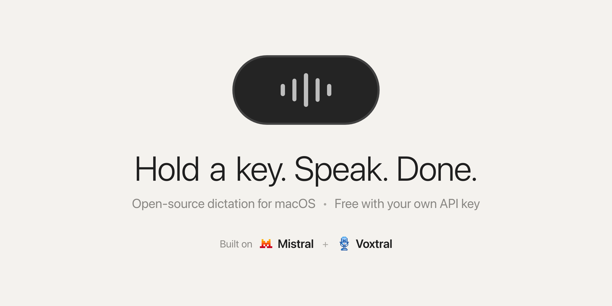

<div align="center">



# OpenSpeaksy

Open-source speech-to-text for macOS, built on [Mistral](https://mistral.ai). Free, with your own API key.

[](https://github.com/slilbudget/OpenSpeaksy/actions/workflows/ci.yml)
[](LICENSE)

</div>

## Keys

| Key | Action |
|:---|:---|
| Hold **right ⌘** or **right ⌥** | Dictate |
| **Right ⌘ + right ⌥** | Dictate hands-free. Tap either key to stop |
| Hold **right ⇧** | Speak Russian, paste English |
| **Caps Lock** | Cancel a stuck transcription. The audio is kept |

Text is pasted at the cursor and stays in the clipboard.

## Install

Requires macOS 13+ and a [Mistral API key](https://console.mistral.ai/api-keys) (free plan, no card).

**With an AI agent** (Claude Code, Codex, Cursor). Paste:

```text
Install OpenSpeaksy on my Mac: https://github.com/slilbudget/OpenSpeaksy
Follow AGENTS.md in the repo. Ask me for my Mistral API key when you need it.
```

**Manually:**

```bash
git clone https://github.com/slilbudget/OpenSpeaksy.git ~/OpenSpeaksy
cd ~/OpenSpeaksy && ./scripts/install.sh
```

Then, either way: **System Settings → Privacy & Security** → allow `~/OpenSpeaksy/venv/bin/python` under **Input Monitoring** and **Accessibility**.

## Settings

Optional, in `~/Library/LaunchAgents/com.openspeaksy.plist` → `EnvironmentVariables`:

| Variable | Default | |
|:---|:---|:---|
| `OPENSPEAKSY_DICTATE_LANGUAGE` | auto | Force a language, e.g. `en` |
| `MISTRAL_MODEL` | `voxtral-mini-2602` | Speech-to-text model |
| `MISTRAL_TRANSLATION_MODEL` | `ministral-8b-latest` | Translation model |

Apply with `launchctl unload` then `launchctl load` on that plist.

## Privacy

Audio goes only to Mistral, under your key. No telemetry; transcripts and the key are never logged. On Mistral's free plan, turn off training: Admin → **Privacy** → **Anonymous improvement data**.

## Troubleshooting

| Problem | Fix |
|:---|:---|
| Nothing happens | Allow **Input Monitoring** |
| Doesn't paste | Allow **Accessibility** |
| Caps Lock types capitals | Keyboard → Modifier Keys → Caps Lock → **No Action** |
| Anything else | `tail -f ~/Library/Logs/com.openspeaksy/main.log` |

## Uninstall

```bash
./scripts/uninstall.sh
```

[MIT](LICENSE). Not affiliated with Mistral AI.
